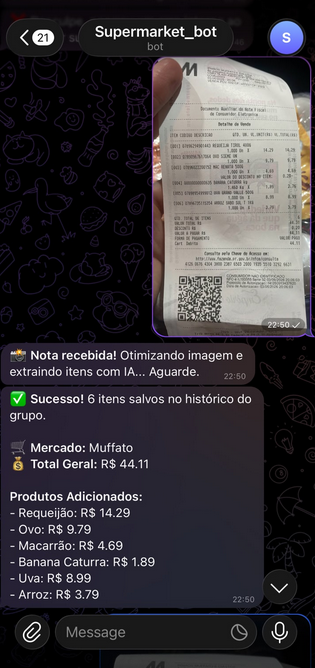

# Supermarket Bot

Assistente inteligente para registro e consulta de preços de supermercado via Telegram.

O projeto utiliza Inteligência Artificial para extrair produtos de notas fiscais enviadas por foto, armazenando um histórico compartilhado de preços entre os participantes de um grupo.

## Visão Geral

O Supermarket Bot foi desenvolvido para auxiliar usuários a monitorarem preços de produtos de supermercado ao longo do tempo.

Através do envio de uma foto da nota fiscal, o sistema:

1. Recebe a imagem pelo Telegram.
2. Processa e otimiza a imagem.
3. Utiliza IA para extrair produtos e valores.
4. Persiste os dados em banco de dados.
5. Disponibiliza histórico de compras para consultas futuras.

Cada compra fica associada a um grupo, permitindo o compartilhamento das informações entre familiares, casais ou moradores de uma mesma residência.

---

## 🚀 Funcionalidades

### Registro automático por nota fiscal

- Upload de imagens diretamente pelo Telegram.
- Processamento automático utilizando Gemini.
- Extração de:
  - Nome do produto
  - Valor pago
  - Quantidade
  - Mercado
  - Data da compra

### Histórico de preços

- Armazenamento persistente das compras.
- Consulta de preços registrados anteriormente.
- Comparação de valores pagos ao longo do tempo.

### Organização por grupos

- Múltiplos usuários podem participar do mesmo grupo.
- Todos os participantes contribuem para o histórico compartilhado.
- Compras vinculadas ao grupo correspondente.

### Cadastro manual

- Inclusão de produtos sem necessidade de nota fiscal.
- Correção de registros quando necessária
- ### Nota enviada



### Resultado processado

```text
Mercado: Muffato
Total: R$ 44,11

Produtos:
- Requeijão: R$ 14,29
- Ovo: R$ 9,79
- Macarrão: R$ 4,69
- Banana: R$ 1,89
- Uva: R$ 8,99
- Arroz: R$ 3,79
```

## 🏗 Arquitetura

```text
┌────────────────────┐
│ Telegram Bot API   │
└──────────┬─────────┘
           │
           ▼
┌────────────────────┐
│ FastAPI Webhook    │
└──────────┬─────────┘
           │
           ▼
┌────────────────────┐
│ Gemini AI          │
│ OCR + Extraction   │
└──────────┬─────────┘
           │
           ▼
┌────────────────────┐
│ Business Services  │
└──────────┬─────────┘
           │
           ▼
┌────────────────────┐
│ PostgreSQL         │
└────────────────────┘
```

## Stack Tecnológica

### Backend

- Python 3.11+
- FastAPI
- SQLAlchemy
- Pydantic

### Banco de Dados

- PostgreSQL

### Inteligência Artificial

- Gemini 2.5 Flash
- Google Generative AI SDK

### Infraestrutura

- Docker
- Render

### Integrações

- Telegram Bot API

## Estrutura do Projeto

```text
market_search/
│
├── config/
│   └── settings.py
│
├── database/
│   ├── connection.py
│   └── models.py
│
├── services/
│   ├── telegram_service.py
│   ├── gemini_service.py
│   └── compras_service.py
│
├── test/
│
├── main.py
├── requirements.txt
└── README.md
```

## Configuração Local

### 1. Clonar o projeto

```bash
git clone https://github.com/seu-usuario/market_search.git

cd market_search
```

### 2. Criar ambiente virtual

```bash
python -m venv .venv
```

Linux/Mac:

```bash
source .venv/bin/activate
```

Windows:

```powershell
.venv\Scripts\activate
```

### 3. Instalar dependências

```bash
pip install -r requirements.txt
```

## Variáveis de Ambiente

Crie um arquivo `.env`:

```env
TELEGRAM_BOT_TOKEN=
GEMINI_API_KEY=
DATABASE_URL=
PORT=8000
```


| Variável          | Descrição                   |
| ------------------ | ----------------------------- |
| TELEGRAM_BOT_TOKEN | Token do Bot do Telegram      |
| GEMINI_API_KEY     | Chave da API Gemini           |
| DATABASE_URL       | String de conexão PostgreSQL |
| PORT               | Porta da aplicação          |

## Banco de Dados

Criar as tabelas:

```bash
python main_db.py
```

O script utiliza os modelos SQLAlchemy definidos em:

```text
database/models.py
```

## Executando a Aplicação

```bash
python main.py
```

Servidor disponível em:

```text
http://localhost:8000
```

### Docker

Build:

```bash
docker build -t supermarket-bot .
```

Run:

```bash
docker run \
-e DATABASE_URL=$DATABASE_URL \
-e TELEGRAM_BOT_TOKEN=$TELEGRAM_BOT_TOKEN \
-e GEMINI_API_KEY=$GEMINI_API_KEY \
-p 8000:8000 \
supermarket-bot
```

## Deploy

O ambiente de produção está hospedado no Render.

### Testes

Executar teste de extração:

```bash
python test/test_gemini.py
```

Executar todos os testes:

```bash
pytest
```

## Limitações Atuais

O projeto encontra-se em fase MVP.

Limitações conhecidas:

- Dependência da qualidade da imagem enviada.
- Algumas categorias de produtos ainda apresentam inconsistências de identificação.
- Produtos com descrições muito abreviadas podem exigir melhorias na normalização.
- Notas fiscais extensas podem demandar processamento adicional.

## Roadmap

### Curto Prazo

- Consulta de histórico via Telegram
- Normalização de produtos
- Cadastro manual de compras
- Histórico por usuário

### Médio Prazo

- Dashboard Web
- Comparação entre mercados
- Gráficos de evolução de preços
- Busca inteligente por produto

### Longo Prazo

- Alertas de promoções
- Recomendação de compras
- Divisão de despesas
- Machine Learning para previsão de preços

## Licença

Projeto desenvolvido para fins de estudo, validação de produto e experimentação com IA aplicada à automação financeira doméstica.
